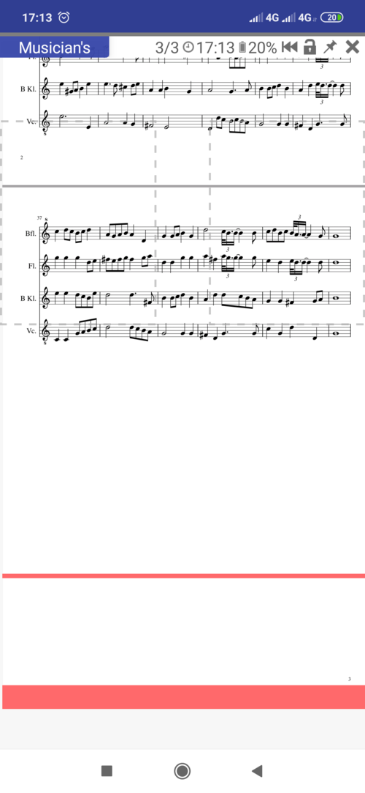

# 8.1

Durch die Nutzung dieser App stimmen Sie den Bestimmungen der [Datenschutzrichtlinie](/wiki/PrivacyPolicy/de) zu.

**Neue Funktionen und Verbesserungen**

* TTS: Aufzeichnen ganzer Bücher oder Seitenbereiche in MP3-Dateien (eine Seite pro Datei)
* Synchronisierung über Android-Geräte über Google Drive (Lesevorgang, Lesezeichen usw.)
* Mehrere Profile
* TTS: Zeichenersetzung, manuelle Belastungsmarkierungen, RegEx-Regeln
* Zusätzliche Einstellungen und Navigation im Musikermodus
* Zusätzliche Funktionen, die über die Benutzeroberfläche erreichbar sind
* Verschiedene Verbesserungen an Benutzeroberfläche und Funktionalität

# Synchronisierung über Google Drive

Die Synchronisierung ist für mehrere Android-Geräte vorgesehen, die mit Google Drive verbunden sind. Während Sie ein Buch lesen, können Sie Ihr Tablet nachts dort abholen, wo Sie tagsüber aufgehört haben. Die Synchronisierung wird von **allen** Apps der Librera-Familie unterstützt. Und es ist KOSTENLOS.

Sie können die folgenden Parameter synchronisieren:

* Lesevorgang für alle Bücher, die Sie gerade lesen (entweder synchronisiert oder nicht). Achten Sie darauf, dass die Dateinamen auf allen Geräten gleich sind. Ihre Bücher werden dann automatisch synchronisiert
* Lesezeichen
* Letzte Liste
* Favoriten und Tags

Beispiele für die Synchronisierung

* Synchronisierung über Google Drive aktivieren (Sie müssen Ihre Google-Anmeldeinformationen zur Hand haben)
* Um ein Buch zu synchronisieren, rufen Sie dessen Menü auf und wählen Sie _Sync_.
* Alle Ihre Bücher auf dem Tab &quot;Favoriten&quot; werden synchronisiert

||||
|-|-|-|
||||
 
 
# Profile

Bei der Verwendung von Profilen werden mehrere Instanzen von Librera auf Ihrem Gerät installiert, jede mit ihren eigenen Einstellungen, Buchlisten, Lesefortschritten und Lesezeichen. Sie können neue Profile erstellen und alte löschen. Alle Apps der Librera-Familie verfügen über diese Funktion.

Profile werden im internen Speicher des Geräts unter /sdcard/Librera/profile.[NAME] gespeichert. Ihre Einstellungen, Lesezeichen und Lesevorgänge werden in JSON-Dateien gespeichert, die mit jedem JSON-Viewer angezeigt werden können (Sie dürfen sie jedoch nicht ändern!).

Wenn Sie **lang auf** eines Profilnamens drücken, wird ein Warnfenster angezeigt, in dem Sie die Standardeinstellungen (Anfangseinstellungen) wiederherstellen können (Ihre Lesezeichen und Lesevorgänge bleiben erhalten).

||||
|-|-|-|
||||

# TTS-Ersetzungen und Wörterbücher

* Tippen Sie in **TTS-Einstellungen** auf &quot;Ersetzungen&quot; und fügen Sie eine neue Leseregel hinzu.
* Ersetzen Sie einen Zeichensatz (in Klammern) durch ein einzelnes Zeichen, das entweder gelesen oder ignoriert werden soll
* Ersetze ein Wort durch ein anderes, zB &quot;lib&quot; -&gt; &quot;Librera&quot;
* Fügen Sie die Belastungsmarkierungen manuell hinzu (sofern Ihr TTS-Motor dies unterstützt): &quot;Librera&quot; -&gt; &quot;Libréra&quot;
* Tippen Sie auf &quot;Anzeigen&quot;, um die Ergebnisse der Ersetzungen anzuzeigen
* Externes Wörterbuch hinzufügen: Librera unterstützt @Voice Aloud- und .txt RegEx-Ersatzdateien

||||
|-|-|-|
||||

# Zusätzliche Einstellungen im Musikermodus

* Tippen-Zonen anzeigen/ausblenden (mit gepunkteten Linien abgegrenzt)
* Letzte Seite mit roten Streifen anzeigen (schmale und breite)
* Markieren Sie Seitentrennzeichen, um die Lesbarkeit zu verbessern
* Navigieren Sie von der ersten zur letzten Seite, indem Sie auf Vorherige Seite tippen
* Navigieren Sie von der letzten zur ersten Seite, indem Sie auf die Zone Nächste Seite tippen

||||
|-|-|-|
||||

# Zusätzliche Funktionen und Verbesserungen der Benutzeroberfläche

* Teilen \ Seiten als Bilder \ Text kopieren (lange auf eine Seitenminiatur im Fenster _Zur Seite wechseln drücken)
* Unterstützung für gekerbte Bildschirme
* Neue Sortierparameter: Sortieren nach **Publisher** und **Veröffentlichungsdatum**

||||
|-|-|-|
||||

# Verschiedenes

* Unterstützung für die Formate MathML und SVG. Aktivieren Sie es in den erweiterten Optionen (kann das anfängliche Laden des Buches verlangsamen)
* Option zum Ignorieren von Metadaten in Bibliotheks- und Ordneransichten (nur Dateinamen werden angezeigt)
* Bewegliches Lesezeichen mit schwebendem Indikator (markiert automatisch Ihre aktuelle Leseposition als Lesezeichen und ermöglicht es Ihnen, nach vorübergehenden Besuchen in anderen Teilen und Abschnitten des Buches mithilfe des Gleitkommas in der rechten unteren Ecke dorthin zurückzukehren). Aktivieren Sie das Kontrollkästchen **Floating**, um ein verschiebbares Lesezeichen zu initiieren (hinzuzufügen)
* Erlaube die Verwendung eines Fingerabdrucks anstelle eines Passworts (Android 9+)
* Ermöglichen Sie, dass das Zeitlimit für den System-Ruhezustand zum Ausschalten des Bildschirms verwendet wird

