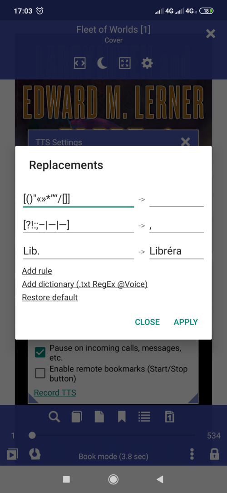

# 8.1

使用此应用，即表示您同意[隐私政策](/wiki/PrivacyPolicy/zh)的条款

**新功能和改进**

* TTS：将整个书籍或页面范围记录到MP3文件中(每个文件一页)
*通过Google云端硬盘在Android设备之间进行同步(阅读进度，书签等)
*多个个人资料
* TTS：字符替换，手动强调标记，RegEx规则
*“音乐家”模式下的其他设置和导航
*可通过用户界面访问的其他功能
* UI和功能的其他改进

#通过Google云端硬盘同步

同步旨在在连接到Google云端硬盘的多个Android设备上使用。读书时，您将可以在晚上在白天停下手机的地方继续使用平板电脑。 Librera系列的**所有**应用程序都支持同步。而且是免费的。

您可以同步以下参数：

*您当前正在阅读的所有图书(已同步或未同步)的阅读进度。在所有设备上都使用相同的文件名，并且图书会自动同步
*书签
*最新清单
*收藏夹和标签

同步范例

*启用通过Google云端硬盘同步(需要提供您的Google凭据)
*要同步一本书，请调用其菜单并选择_Sync_
*您在“收藏夹”标签中的所有图书都会同步

||||
|-|-|-|
||||
 
 
#个人资料

使用配置文件就像在设备上安装了多个Librera实例，每个实例都有其单独的设置，书目，阅读进度和书签。您可以创建新的配置文件并删除旧的配置文件。 Librera系列的所有应用程序都具有此功能。

配置文件存储在设备的内部存储器中的/sdcard/Librera/profile.[NAME]。它们的设置，书签，阅读进度存储在JSON文件中，可以使用任何JSON-viewer进行查看(不过请不要修改它们！)。

对配置文件名称进行**长按**将弹出一个警报窗口，供您恢复其默认(初始)设置(您的书签和阅读进度将保持不变)。

||||
|-|-|-|
||||

# TTS替换和词典

*在“ **TTS设置**”中点击“替换”，然后添加新的阅读规则。
*替换一组字符(用括号括起来)，其中包含要读取或忽略的单个字符
*将一个词替换为另一个词，例如“ lib”-&gt;“ Librera”
*手动添加压力标记(如果您的TTS引擎支持)：“ Librera”-&gt;“Libréra”
*点击“显示”以查看替换结果
*添加外部词典：Librera支持@Voice Aloud和.txt RegEx替换文件

||||
|-|-|-|
||||

#音乐家模式下的其他设置

*显示\隐藏点击区域(用虚线描绘)
*在最后一页显示红色条纹(窄条纹和宽条纹)
*突出显示页面分隔符以提高可读性
*通过点击“上一页”区域导航到第一页到最后一页
*通过点击“下一页”区域从上一页导航到第一页

||||
|-|-|-|
||||

# UI的附加功能和改进

*共享/复制页面作为图像\文本(长按_Go to Page_窗口中的页面缩略图)
*支持带缺口的屏幕
*新的排序参数：按**发布商**和**发布日期**排序

||||
|-|-|-|
||||

#其他

*支持MathML和SVG格式。在“高级”选项中启用它(可能会减慢初始书籍的加载速度)
*选项，可在“库”和“文件夹”视图中忽略元数据(仅显示文件名)
*可移动的书签，带有一个浮动指示器(在临时访问该书的其他部分之后，可以通过右下角的浮动框自动为您当前的阅读位置添加书签，并允许您跳回到该位置)。要启动(添加)可移动书签，请选中**浮动**框
*允许使用指纹代替密码(Android 9+)
*允许系统睡眠超时用于关闭屏幕

